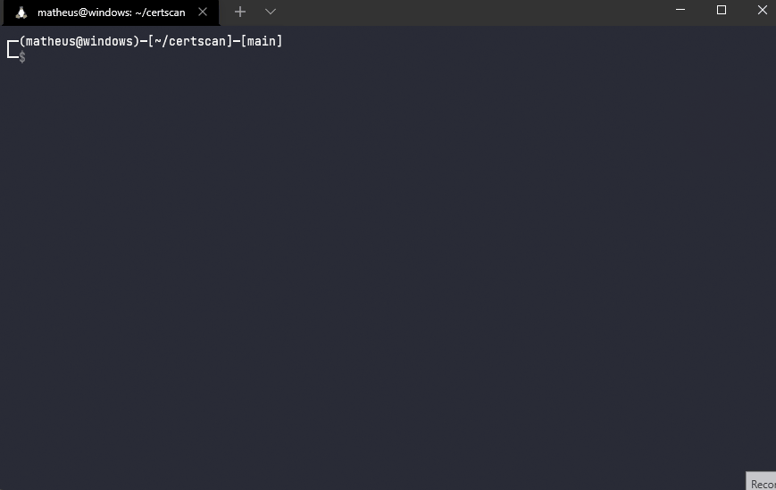

<div align="center">
  
</div>

<details open="open">
  <summary>Table of Contents</summary>
  <ol>
    <li><a href="#about">About</a></li>
    <li><a href="#usage">Usage</a></li>
    <li><a href="#installation">Installation</a></li>
    <li><a href="#contributing">Contributing</a></li>
    <li><a href="#license">License</a></li>
  </ol>
</details>

## About
Command line tool to get information in different formats from a local or web domain SSL certificate.



## Usage

Supports base64 and binary certificate content.

### Extraction types

- Get information from a local certificate by passing `-f` as an argument and then the filename:

`certscan -f <file>`

- Get information from many local certificates by passing `-d` as an argument and then the name of the directory containing the certificates:

`certscan -d <dir>`

- Get information from a certificate by passing `-u` as an argument and then the domain name:

`certscan -u <domain>`

- Get information from many certificates by passing `-r` as an argument and then the filename containing a list of domain names:

`certscan -r <file>`

### Output types

- json - append:  `-j`
- text - append: `-t`
- csv - append: `-c`

### Output example
`certscan -u github.com -j`

```json
[
    {
        "subject_common_name": "github.com",
        "subject_alt_name": [
            "github.com",
            "www.github.com"
        ],
        "issuer_common_name": "DigiCert High Assurance TLS Hybrid ECC SHA256 2020 CA1",
        "issuer_org_name": "DigiCert, Inc.",
        "serial_number": 19335859262210987870682549325523936958,
        "version": 2,
        "has_expired": false,
        "not_before": "2021-03-25T00:00:00",
        "not_after": "2022-03-30T23:59:59",
        "days_to_expire": 53,
        "self_signed": false
    }
]
```

## Installation

#### 1. Install python and pip
```
sudo apt install python3 && python3-pip
```

#### 2. Clone git repository
```
git clone https://github.com/almeida-matheus/certscan
```

#### 3. Install the script
```
cd certscan
make setup
```

## Contributing
1. Fork the project
2. Create your branch (`git checkout -b branch-name`)
3. Add your changes (`git add .`)
4. Commit your changes (`git commit -m 'add some feature'`)
5. Push to the branch (`git push origin branch-name`)
6. Open a pull request

## License
Distributed under the MIT License. See [LICENSE](LICENSE) for more information.